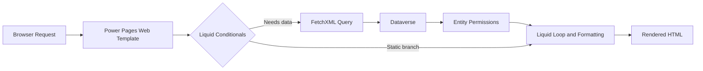

# Power Pages Liquid Examples

Practical Liquid patterns for Microsoft Power Pages, focused on common portal scenarios: user-aware rendering, navigation, looping, Dataverse queries, layout snippets, and paging.

This repository is meant to be copied from. Each page keeps the examples small enough to drop into a Web Template or Web Page, then adapt to your table and field names.

## What this repo covers

- signed-in vs anonymous rendering
- conditional content and safe fallbacks
- loops, collections, and navigation
- Dataverse-backed FetchXML patterns
- reusable layout snippets
- paging-cookie based paging
- testing, review, and troubleshooting guidance

## How the pieces fit together



## Starter pattern

Use this as a baseline when building a new snippet.

```liquid



  <h1>Welcome, {{ user.fullname | default: "User" | escape }}</h1>

  <h1>Welcome</h1>



<fetch top="{{ record_limit }}">
  <entity name="account">
    <attribute name="accountid" />
    <attribute name="name" />
    <order attribute="name" />
  </entity>
</fetch>


<ul>
  
    <li>{{ record.name | default: "Unnamed account" | escape }}</li>
  
</ul>
```

## Pages

- [Current User Examples](current-user.md)
- [Conditional Rendering](conditional-rendering.md)
- [Loops and Lists](loops-and-lists.md)
- [Navigation and Web Links](navigation-and-weblinks.md)
- [Entity and Data Patterns](entity-and-data-patterns.md)
- [Layout and Content Snippets](layout-and-content-snippets.md)
- [Examples Adapted](examples-adapted.md)
- [Paging Demo](paging-demo.md)
- [Troubleshooting](troubleshooting.md)
- [Testing Notes](testing-notes.md)
- [Review Checklist](review-checklist.md)
- [Examples Preview (rendered HTML)](examples-preview.html)

## Quick start

1. Copy a Liquid block into a Power Pages Web Template.
2. Replace entity names, attribute names, and URLs for your portal.
3. Verify Entity Permissions for both anonymous and authenticated users.
4. Test empty states before publishing.

## Working assumptions

- Examples are intentionally small and presentation-focused.
- Dataverse schema names differ by tenant, so adapt logical names.
- FetchXML output shape can vary slightly by portal version.
- Always validate behavior in a development portal before production use.