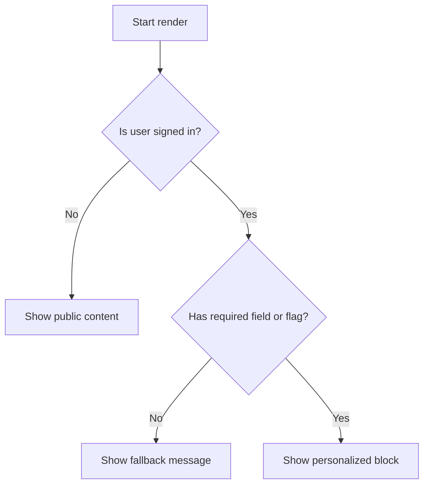

# Conditional Rendering

Conditional rendering is the core of most Power Pages Liquid templates. Use it to branch on authentication state, optional fields, feature flags, and query results.

## Decision flow



## Basic if / else

```liquid

  <p>Signed in</p>

  <p>Not signed in</p>

```

## Check for blank values

```liquid

  <h1>{{ page.title | escape }}</h1>

  <h1>Untitled page</h1>

```

## Multi-branch rendering with elsif

```liquid



  <span class="badge badge-open">Open</span>

  <span class="badge badge-pending">Pending response</span>

  <span class="badge badge-closed">Closed</span>

```

## Combine conditions safely

```liquid

  <p>Hello {{ user.fullname | escape }}</p>

```

## Guard optional data before rendering a section

```liquid

  <section class="contact-summary">
    <h2>Phone</h2>
    <p>{{ account.telephone1 | escape }}</p>
  </section>

```

## Personalization with a Dataverse-backed flag

```liquid

  <div class="banner banner-beta">
    Early access enabled for {{ user.fullname | escape }}
  </div>

```

## Permission-aware empty state

This pattern keeps the page useful even when the user cannot see the underlying data.

```liquid

  <ul>
    
      <li>{{ case.title | default: "Untitled case" | escape }}</li>
    
  </ul>

  <p>No visible cases were found for your account.</p>

  <p>Sign in to view your cases.</p>

```

## Practical rules

- Prefer explicit fallbacks over silently rendering nothing.
- Keep conditional branches close to the markup they control.
- Avoid nesting many levels of if blocks; extract repeated logic into a helper snippet when needed.
- Treat empty query results and permission-trimmed results as separate user experiences.