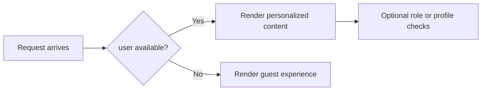

# Current User Examples

These patterns use the current signed-in user context exposed by Power Pages. The main rule is simple: always assume the page may also render for an anonymous visitor.

## User context flow



## Welcome message

```liquid

  <p>Welcome, {{ user.fullname | default: "there" | escape }}</p>

  <p>Welcome, guest</p>

```

## Current user email

```liquid

  <p>{{ user.emailaddress1 | escape }}</p>

```

## Signed-in only link

```liquid

  <a href="/profile">My Profile</a>

```

## Anonymous-only link

```liquid

  <a href="/sign-in">Sign In</a>

```

## Show a profile summary card

```liquid

  <section class="profile-card">
    <h2>{{ user.fullname | default: "Portal user" | escape }}</h2>
    <p>{{ user.emailaddress1 | default: "No email on file" | escape }}</p>
    <a href="/profile">Manage profile</a>
  </section>

```

## Role-based UI branch

Portal implementations differ in how role information is exposed. If your project maps web roles into a helper variable, keep the actual check small and readable.

```liquid



  <a class="btn" href="/premium">Premium dashboard</a>

```

## Defensive display pattern

```liquid



  <p>Signed in as {{ display_name | escape }}</p>

```

## Practical rules

- Never assume every user property is populated.
- Escape user-derived output even when it looks harmless.
- Keep authenticated and anonymous experiences both intentional.
- Centralize role and capability checks if more than one template depends on them.