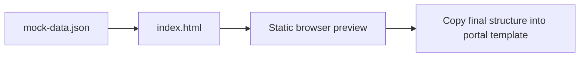

# Demo Preview Harness

This folder contains a tiny static preview for the HTML shape of the examples in this repository. It is useful when you want to sanity-check layout and copy before pasting Liquid into a real Power Pages site.

## Preview flow



## Files

- index.html: static preview page
- mock-data.json: sample data used by the preview

## How to use it

1. Open index.html in a modern browser.
2. Check the rendered cards, lists, and labels.
3. Use the structure as a reference when adapting the Liquid snippets in the root docs.

## Mock shape example

```json
{
  "accounts": [
    {
      "name": "Contoso Ltd",
      "accountnumber": "A-1001"
    }
  ]
}
```

## What this demo does not do

- It does not execute Liquid.
- It does not run FetchXML.
- It does not enforce Entity Permissions.

Use the preview for layout only. Use a development Power Pages portal for real validation.