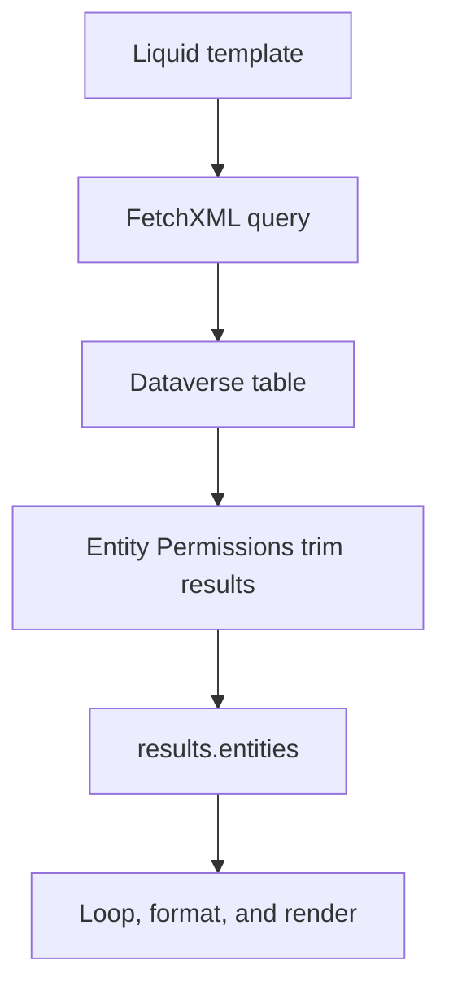
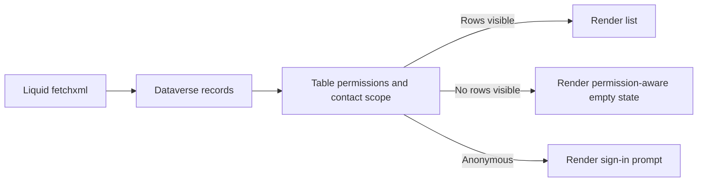

# Entity and Data Patterns

Liquid should stay close to presentation. Use FetchXML to retrieve only the data needed, then keep the template logic focused on rendering and safe defaults.

## Data flow



## Render a simple value safely

```liquid

  <p>{{ user.fullname | escape }}</p>

```

## Default and escape pattern

```liquid
<p>{{ record.description | default: "No description" | escape }}</p>
```

## Date and text formatting

```liquid
<p>{{ page.title | upcase }}</p>
<p>{{ now | date: "%d %B %Y" }}</p>
```

## Simple FetchXML to list cases

```liquid

<fetch top="5">
  <entity name="incident">
    <attribute name="incidentid" />
    <attribute name="title" />
    <attribute name="ticketnumber" />
    <attribute name="createdon" />
    <filter>
      <condition attribute="statecode" operator="eq" value="0" />
    </filter>
    <order attribute="createdon" descending="true" />
  </entity>
</fetch>



  <div class="cases">
    
      <article class="case">
        <h3>{{ case.title | default: "Untitled case" | escape }}</h3>
        <p>Reference: {{ case.ticketnumber | default: "n/a" | escape }}</p>
        <time>{{ case.createdon | date: "%b %d, %Y" }}</time>
      </article>
    
  </div>

```

## Linked entity example

```liquid

<fetch top="20">
  <entity name="account">
    <attribute name="accountid" />
    <attribute name="name" />
    <link-entity name="contact" from="contactid" to="primarycontactid" alias="pc">
      <attribute name="fullname" />
      <attribute name="emailaddress1" />
    </link-entity>
  </entity>
</fetch>



  <div class="account-card">
    <h3>{{ account.name | escape }}</h3>
    
      <p>Primary contact: {{ account.pc.fullname | escape }}</p>
    
  </div>

```

## Table-permission-aware record list

This pattern separates three outcomes that are often confused in portals: anonymous access, authenticated but no visible rows, and actual visible data.

```liquid

<fetch top="10">
  <entity name="invoice">
    <attribute name="invoiceid" />
    <attribute name="name" />
    <attribute name="invoicenumber" />
    <attribute name="totalamount" />
    <order attribute="createdon" descending="true" />
  </entity>
</fetch>



  <ul class="invoice-list">
    
      <li>
        <strong>{{ invoice.name | default: invoice.invoicenumber | escape }}</strong>
        <span>{{ invoice.totalamount | default: "Amount unavailable" }}</span>
      </li>
    
  </ul>

  <p>No visible invoices were found for your account.</p>
  <p>If you expected data here, check table permissions, contact scope, and linked web roles.</p>

  <p>Sign in to view invoices tied to your contact record.</p>

```

## Permission flow



## Schema adapter template

```liquid

<fetch top="10">
  <entity name="ENTITY_NAME">
    <attribute name="ATTR_ID" />
    <attribute name="ATTR_TITLE" />
    <filter>
      <condition attribute="FILTER_ATTR" operator="eq" value="FILTER_VALUE" />
    </filter>
  </entity>
</fetch>



  <article>
    <h4>{{ row.ATTR_TITLE | escape }}</h4>
  </article>

```

## Aggregated count block

If the query is small, a count banner is often enough.

```liquid
<p class="summary-count">Visible records: {{ results.entities.size }}</p>
```

## Practical rules

- Request only the fields you actually render.
- Keep joins narrow and explicit.
- Use deterministic sort orders when paging or comparing results.
- Expect Entity Permissions to change what the template receives.
- Keep permission-trimmed empty states distinct from technical failures.
- Move complex transformations into Dataverse views, calculated fields, or upstream processes.