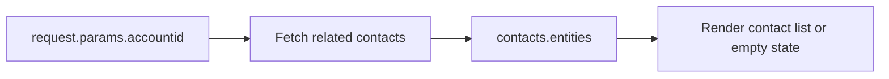

# Adapted Examples

These examples are closer to a typical Dataverse schema so they can be copied into a Power Pages Web Template with minimal adaptation.

## Account list pattern

```liquid

<fetch top="10">
  <entity name="account">
    <attribute name="accountid" />
    <attribute name="name" />
    <attribute name="accountnumber" />
    <attribute name="createdon" />
    <filter>
      <condition attribute="statecode" operator="eq" value="0" />
    </filter>
    <order attribute="createdon" descending="true" />
  </entity>
</fetch>


<ul class="accounts-list">
  
    <li>
      <h3><a href="/account/{{ account.accountid }}">{{ account.name | escape }}</a></h3>
      <p>Account #: {{ account.accountnumber | default: "n/a" | escape }}</p>
      <time>{{ account.createdon | date: "%Y-%m-%d" }}</time>
    </li>
  
</ul>
```

## Account detail with related contacts



```liquid

<fetch>
  <entity name="contact">
    <attribute name="contactid" />
    <attribute name="fullname" />
    <attribute name="emailaddress1" />
    <filter>
      <condition attribute="_parentcustomerid_value" operator="eq" value="{{ request.params.accountid }}" />
    </filter>
    <order attribute="fullname" />
  </entity>
</fetch>



  <ul class="contact-list">
    
      <li>
        <strong>{{ contact.fullname | default: "Unnamed contact" | escape }}</strong>
        
          <a href="mailto:{{ contact.emailaddress1 }}">{{ contact.emailaddress1 | escape }}</a>
        
      </li>
    
  </ul>

  <p>No contacts found for this account.</p>

```

## Recent cases pattern

```liquid

<fetch top="5">
  <entity name="incident">
    <attribute name="incidentid" />
    <attribute name="title" />
    <attribute name="ticketnumber" />
    <attribute name="createdon" />
    <filter>
      <condition attribute="statecode" operator="eq" value="0" />
    </filter>
    <order attribute="createdon" descending="true" />
  </entity>
</fetch>


<ul class="cases-list">
  
    <li>
      <a href="/case/{{ case.incidentid }}">{{ case.title | default: "(no title)" | escape }}</a>
      <span class="ref">{{ case.ticketnumber | default: "-" | escape }}</span>
      <time>{{ case.createdon | date: "%b %d, %Y" }}</time>
    </li>
  
</ul>
```

## Permission-aware invoices example

```liquid

<fetch top="10">
  <entity name="invoice">
    <attribute name="invoiceid" />
    <attribute name="name" />
    <attribute name="invoicenumber" />
    <attribute name="totalamount" />
    <order attribute="createdon" descending="true" />
  </entity>
</fetch>



  <ul class="invoice-list">
    
      <li>
        <a href="/invoice/{{ invoice.invoiceid }}">{{ invoice.name | default: invoice.invoicenumber | escape }}</a>
        <span class="ref">{{ invoice.totalamount | default: "Amount unavailable" }}</span>
      </li>
    
  </ul>

  <p>No visible invoices were found for your account.</p>

  <p>Sign in to view invoices.</p>

```

## Status badge helper

```liquid

  
  <span class="status-badge">{{ status_label | escape }}</span>

```

## Adaptation checklist

- Replace logical names if your environment uses custom tables or columns.
- Confirm every referenced attribute is included in the FetchXML.
- Add empty states before putting a snippet into production.
- Verify portal permissions with a real contact, not only an admin user.