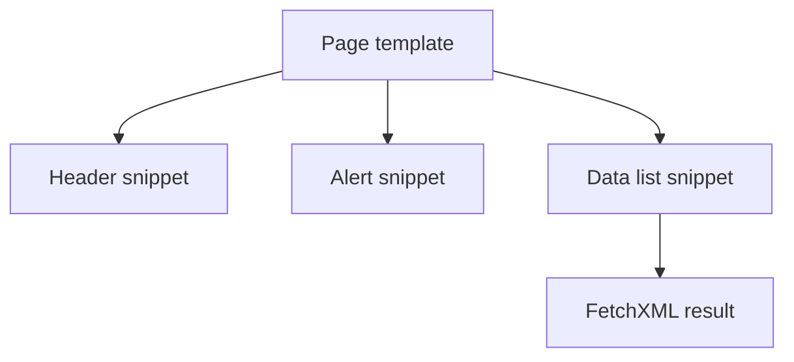

# Layout and Content Snippets

Small, reusable snippets make Power Pages templates easier to maintain. The best snippets have one job, require very little context, and fail safely when data is missing.

## Snippet composition



## Welcome panel pattern

```liquid
<section class="welcome-panel">
  
    <h2>Welcome, {{ user.fullname | default: "User" | escape }}</h2>
    <p>Use the links below to continue.</p>
  
    <h2>Welcome</h2>
    <p>Please sign in to continue.</p>
  
</section>
```

## Notification banner

```liquid

  <div class="alert alert-info" role="status">
    {{ request.params.notice | escape }}
  </div>

```

## Empty state block

```liquid

  <section class="empty-state">
    <h2>No links available</h2>
    <p>Update the configured web link set and publish again.</p>
  </section>

```

## Reusable record summary card

```liquid
<article class="summary-card">
  <h3>{{ record.name | default: "Untitled record" | escape }}</h3>
  <p>{{ record.description | default: "No description available" | escape }}</p>
</article>
```

## Recent content snippet

```liquid

<fetch top="5">
  <entity name="msfp_survey">
    <attribute name="msfp_surveyid" />
    <attribute name="msfp_name" />
    <attribute name="createdon" />
    <order attribute="createdon" descending="true" />
  </entity>
</fetch>


<aside class="recent-content">
  <h2>Recent content</h2>
  <ul>
    
      <li>
        <a href="/content/{{ item.msfp_surveyid }}">{{ item.msfp_name | escape }}</a>
        <time>{{ item.createdon | date: "%Y-%m-%d" }}</time>
      </li>
    
  </ul>
</aside>
```

## Section wrapper with optional heading

```liquid


<section class="content-block">
  
    <h2>{{ section_title | escape }}</h2>
  
  {{ content }}
</section>
```

## Practical rules

- Document the inputs each snippet expects.
- Keep snippets focused on layout and light presentation logic.
- Prefer fallback copy over blank regions.
- Reuse markup patterns so accessibility fixes land in one place.