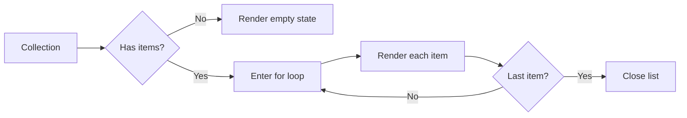

# Loops and Lists

Loops are the normal way to render navigation, cards, tables, and Dataverse result sets. The goal is to keep the loop body readable and handle first, last, and empty states intentionally.

## Loop anatomy



## Basic web link loop

```liquid

  <a href="{{ item.url }}">{{ item.name | escape }}</a>

```

## Loop with index

```liquid

  <div class="nav-item">
    <span class="nav-index">{{ forloop.index }}.</span>
    <a href="{{ item.url }}">{{ item.name | escape }}</a>
  </div>

```

## First and last markers

```liquid

  
    <p>Primary links</p>
  

  <a href="{{ item.url }}">{{ item.name | escape }}</a>

  
    <p>End of navigation</p>
  

```

## Dataverse results loop

```liquid

<fetch top="10">
  <entity name="account">
    <attribute name="accountid" />
    <attribute name="name" />
    <attribute name="accountnumber" />
    <order attribute="createdon" descending="true" />
  </entity>
</fetch>



  <ul class="accounts-list">
    
      <li>
        <h3>{{ account.name | default: "Unnamed account" | escape }}</h3>
        <p>Account number: {{ account.accountnumber | default: "-" | escape }}</p>
      </li>
    
  </ul>

  <p>No accounts available.</p>

```

## Group-like heading pattern

This is useful when the list has a special first record.

```liquid

  
    <h2>Featured article</h2>
  
    
      <h2>More articles</h2>
    
  

  <article>
    <h3>{{ article.title | escape }}</h3>
  </article>

```

## Basic page-number paging

```liquid




<fetch mapping="logical" count="{{ page_size }}" page="{{ current_page }}">
  <entity name="account">
    <attribute name="accountid" />
    <attribute name="name" />
    <order attribute="name" />
  </entity>
</fetch>


<nav class="pager">
  
    <a href="?page={{ current_page | minus: 1 }}">Previous</a>
  

  <span>Page {{ current_page }}</span>

  
    <a href="?page={{ current_page | plus: 1 }}">Next</a>
  
</nav>
```

## Paging-cookie handoff

```liquid

  <a href="?pagingcookie={{ results.paging_cookie | url_encode }}">Next</a>

```

## Practical rules

- Prefer semantic lists when rendering repeated content.
- Keep loop bodies small; assign intermediate values outside when needed.
- Always define an empty state for query-driven lists.
- Use page-number paging for simple cases and paging cookies for stable large datasets.