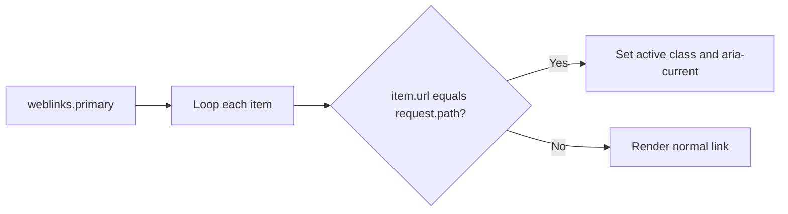

# Navigation and Web Links

Navigation in Power Pages is usually a combination of a web link set, the current request path, and sometimes user state. Keep the markup semantic and the active-state logic obvious.

## Navigation rendering flow



## Simple navigation list

```liquid
<ul>
  
    <li><a href="{{ item.url }}">{{ item.name | escape }}</a></li>
  
</ul>
```

## Active class pattern

```liquid

  <a href="{{ item.url }}"
     class="active">
    {{ item.name | escape }}
  </a>

```

## Accessible primary navigation

```liquid
<nav aria-label="Primary navigation">
  <ul>
    
      
      <li>
        <a href="{{ item.url }}"
           class="active"
           aria-current="page">
          {{ item.name | escape }}
        </a>
      </li>
    
  </ul>
</nav>
```

## Auth-aware navigation branch

```liquid
<nav aria-label="Account navigation">
  <ul>
    <li><a href="/">Home</a></li>
    
      <li><a href="/profile">My Profile</a></li>
      <li><a href="/cases">My Cases</a></li>
    
      <li><a href="/sign-in">Sign In</a></li>
    
  </ul>
</nav>
```

## Role-aware navigation helper

When navigation rules depend on more than signed-in state, compute a small capability flag first and keep the markup branch shallow.

```liquid



<nav aria-label="Portal sections">
  <ul>
    <li><a href="/">Home</a></li>
    
      <li><a href="/profile">My Profile</a></li>
      <li><a href="/cases">My Cases</a></li>
    
    
      <li><a href="/support">Support workspace</a></li>
    
    
      <li><a href="/premium">Premium dashboard</a></li>
    
  </ul>
</nav>
```

## Hide restricted links instead of teasing them

For portal navigation, a hidden link is usually better than rendering a disabled item that the user can never access.

```liquid

  <a href="/invoices">Invoices</a>

```

## New-tab external link pattern

```liquid
<a href="https://learn.microsoft.com/"
   target="_blank"
   rel="noopener noreferrer">
  Product documentation
</a>
```

## Inline breadcrumb example

```liquid
<nav aria-label="Breadcrumb">
  <ol class="breadcrumb">
    <li><a href="/">Home</a></li>
    <li><a href="/support">Support</a></li>
    <li aria-current="page">Case details</li>
  </ol>
</nav>
```

## Practical rules

- Verify which web link set a template is using before debugging markup.
- Use aria-current for the active item instead of relying on color alone.
- Keep anonymous and authenticated menus intentionally different when required.
- Compute role or capability flags before rendering the list when the menu has multiple gated items.
- Prefer descriptive link text over generic labels.