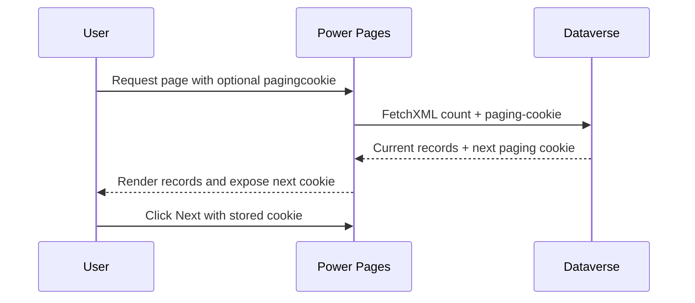

# Paging Demo

This page shows a practical cursor-style paging pattern using FetchXML paging cookies and a small JavaScript helper. Use it when result sets are large enough that simple page numbers are not stable enough.

## Paging-cookie flow



## Server-side Liquid template

```liquid




<fetch mapping="logical" count="{{ page_size }}" paging-cookie="{{ incoming_cookie }}">
  <entity name="account">
    <attribute name="accountid" />
    <attribute name="name" />
    <order attribute="name" />
  </entity>
</fetch>


<div id="results">
  <ul>
    
      <li>{{ record.name | escape }}</li>
    
  </ul>
</div>

<div id="pager" data-next-cookie="{{ results.paging_cookie | escape }}">
  <button id="prevBtn" type="button" disabled>Previous</button>
  <button id="nextBtn" type="button">Next</button>
</div>
```

## Client-side helper

```html
<script>
  (function () {
    var pageKey = 'pp_paging_stack_v1';

    function readStack() {
      try {
        return JSON.parse(sessionStorage.getItem(pageKey) || '[]');
      } catch (error) {
        return [];
      }
    }

    function writeStack(stack) {
      sessionStorage.setItem(pageKey, JSON.stringify(stack));
    }

    function navigateWithCookie(cookie) {
      var url = new URL(window.location.href);
      if (cookie) {
        url.searchParams.set('pagingcookie', cookie);
      } else {
        url.searchParams.delete('pagingcookie');
      }
      window.location.href = url.toString();
    }

    var pager = document.getElementById('pager');
    var nextCookie = pager.getAttribute('data-next-cookie');
    var prevButton = document.getElementById('prevBtn');
    var nextButton = document.getElementById('nextBtn');
    var currentCookie = new URLSearchParams(window.location.search).get('pagingcookie');
    var stack = readStack();

    if (currentCookie && stack[stack.length - 1] !== currentCookie) {
      stack.push(currentCookie);
      writeStack(stack);
    }

    prevButton.disabled = stack.length <= 1;
    nextButton.disabled = !nextCookie;

    prevButton.addEventListener('click', function () {
      var previousStack = readStack();
      previousStack.pop();
      var previousCookie = previousStack.length > 0 ? previousStack[previousStack.length - 1] : null;
      writeStack(previousStack);
      navigateWithCookie(previousCookie);
    });

    nextButton.addEventListener('click', function () {
      if (!nextCookie) {
        return;
      }
      navigateWithCookie(nextCookie);
    });
  })();
</script>
```

## Simpler next-link pattern

If you only need forward navigation, keep it smaller.

```liquid

  <a href="?pagingcookie={{ results.paging_cookie | url_encode }}">Next page</a>

```

## Practical rules

- Use a deterministic order in the FetchXML query.
- Confirm which property name your portal uses for the returned paging cookie.
- Use session storage only when per-tab behavior is acceptable.
- Keep the non-JavaScript fallback simple when possible.