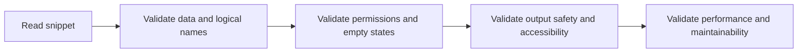

# Review Checklist

Use this checklist when reviewing a Web Template, Web Page template, or shared snippet. The aim is to catch correctness, permission, and maintainability issues before the example gets copied into a real portal.

## Review sequence



## Correctness

- Does the template reference the correct entity and attribute logical names?
- Are all rendered fields included in the FetchXML query?
- Are optional values handled with defaults or conditionals?

## Security and permissions

- Does the example behave correctly for anonymous and authenticated users?
- Are Entity Permissions and web roles reflected in the expected output?
- Is any sensitive field rendered without a clear reason?

## Output safety

- Is user or record text escaped where appropriate?
- Are links, labels, and fallback values safe and readable?

## Accessibility and markup

- Is semantic markup used for lists, navigation, and headings?
- Is the active navigation state expressed with aria-current when relevant?
- Are empty states understandable without relying on color alone?

## Performance

- Does the FetchXML request only the needed rows and columns?
- Is paging used where result sets can grow?
- Are joins and per-item branches kept reasonable?

## Maintainability

- Are role checks and capability flags centralized rather than duplicated?
- Is the snippet small enough to understand in one read?
- Are assumptions documented for the next maintainer?

## Quick review snippet

This tiny block often exposes whether the template has good fallbacks.

```liquid

<h2>{{ title_text | escape }}</h2>
```

## Exit criteria

- The example degrades safely when data is missing.
- The example is readable without guessing hidden assumptions.
- The example is realistic enough to copy into a dev portal and test immediately.