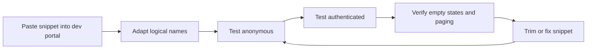

# Testing Notes

Use a development portal to validate the snippets in this repo. Most issues only show up when the snippet runs under real portal identity, real Entity Permissions, and real published site metadata.

## Test loop



## Basic validation steps

1. Create a Web Template or Web Page in a development environment.
2. Paste in one example from this repo.
3. Replace entity names, field names, and URLs to match your schema.
4. Publish the page and load it as both an anonymous and authenticated user.

## Detail-page testing

Some examples expect query parameters such as an account id.

```text
/account-details?accountid=GUID-HERE
```

Confirm that the page handles both a valid id and a missing or invalid id.

## Temporary debug patterns

```liquid

  <pre>
  path={{ request.path | escape }}
  user={{ user.fullname | default: "anonymous" | escape }}
  count={{ results.entities.size | default: 0 }}
  </pre>

```

```liquid

  <pre>{{ results | json | escape }}</pre>

```

## Paging checks

- Move forward and back through the result set.
- Confirm the sort order stays stable.
- If using session storage, inspect the stored cookie stack in browser dev tools.

## Accessibility checks

- Verify headings are in a sensible order.
- Confirm navigation exposes the active page state.
- Check empty states are understandable without context from surrounding pages.

## Performance checks

- Limit fetched attributes to those actually rendered.
- Watch for slow joins and oversized result sets.
- Test with a realistic number of rows, not only a tiny seed dataset.

## Exit criteria

- The snippet renders correctly for the intended audience.
- The snippet behaves safely when data is empty or missing.
- The snippet can be understood and adapted by someone else on the team.