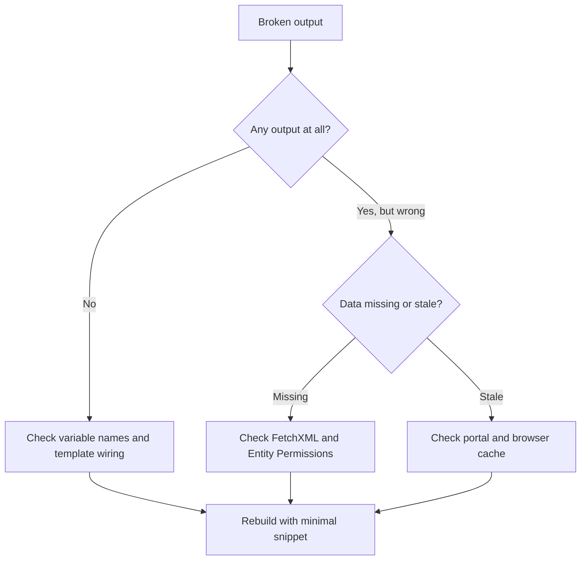

# Troubleshooting

Most Power Pages Liquid issues reduce to four areas: missing context, permissions, caching, or over-complicated templates. The fastest path is to reduce the template until the failure is obvious.

## Triage flow



## Blank output

Check:

- variable exists
- user is signed in when the snippet expects a user
- required field has data
- the correct Web Template or Web Page is published

## Navigation not rendering

Check:

- the intended web link set is configured
- page visibility and publishing state are correct
- signed-in and anonymous users are not seeing different menus by design

## Output looks stale

Check:

- portal cache
- browser cache
- unpublished changes
- wrong environment or site binding

## Liquid becomes too complex

That is usually a sign to move logic elsewhere:

- Dataverse model or view
- Power Automate
- plugin logic
- server-side integration layer

## Minimal debug block

Use this temporarily to prove what the template can actually see.

```liquid
<pre>
user: signed inanonymous
record count: {{ results.entities.size | default: 0 }}
page path: {{ request.path | escape }}
</pre>
```

## Safe query-result debug

```liquid

  <pre>{{ results | json | escape }}</pre>

```

## Common failure patterns

- Permission-trimmed results: the query works for admins but returns nothing for real portal users.
- Missing attributes: the template references a field that was never requested in FetchXML.
- Over-joined FetchXML: the page slows down or times out because the query is doing too much work.
- Cache confusion: the markup changed, but the portal is still serving an older compiled version.

## Practical rules

- Start with one entity and one attribute, then build up.
- Test with the same contact and web role combination your real users have.
- Add temporary debug output behind a query-string flag.
- Remove debug blocks before publishing broadly.